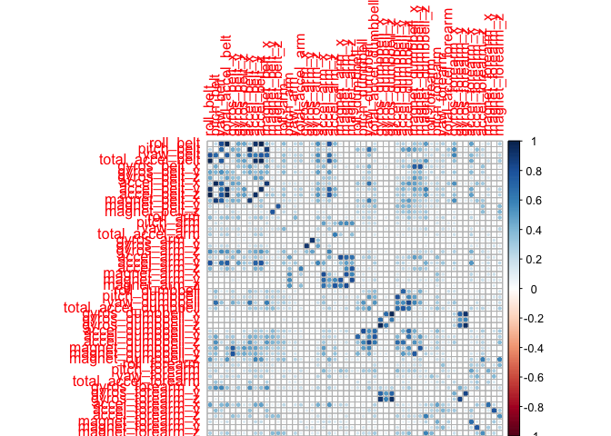

# Practical Machine Learning Course Project
Matth Cret  
August, 12 2017  

The study is carried out using RStudio 1.0.143.

## Project Background

Using devices such as Jawbone Up, Nike FuelBand, and Fitbit it is now possible to collect a large amount of data about personal activity relatively inexpensively. These type of devices are part of the quantified self movement – a group of enthusiasts who take measurements about themselves regularly to improve their health, to find patterns in their behavior, or because they are tech geeks. One thing that people regularly do is quantify how much of a particular activity they do, but they rarely quantify how well they do it. In this project, your goal will be to use data from accelerometers on the belt, forearm, arm, and dumbell of 6 participants. They were asked to perform barbell lifts correctly and incorrectly in 5 different ways. More information is available from the website here:  
http://web.archive.org/web/20161224072740/http:/groupware.les.inf.puc-rio.br/har (see the section on the Weight Lifting Exercise Dataset).

## Getting Data

The training data for this project are available here:  
https://d396qusza40orc.cloudfront.net/predmachlearn/pml-training.csv

The test data are available here:  
https://d396qusza40orc.cloudfront.net/predmachlearn/pml-testing.csv

Both csv files are downloaded in the same directory where the R Markdown file is located. The data sets are loaded as data.frame objects set.training and set.testing respectively.


```r
### Initialize the url and file name
url.training <- "https://d396qusza40orc.cloudfront.net/predmachlearn/pml-training.csv"
url.testing <- "https://d396qusza40orc.cloudfront.net/predmachlearn/pml-testing.csv"
training.csv <- paste(getwd(),"/training.csv",sep = "")
testing.csv <- paste(getwd(),"/testing.csv",sep = "")

### Download the csv files
if (!file.exists(training.csv)) {
    download.file(url.training, destfile=training.csv)
}
if (!file.exists(testing.csv)) {
    download.file(url.testing, destfile=testing.csv)
}

### Load the csv files as data.frame objects
set.training <- read.csv(training.csv)
set.testing <- read.csv(testing.csv)

### Analyse dimensions of the two datasets
dim(set.training)
```

```
## [1] 19622   160
```

```r
dim(set.testing)
```

```
## [1]  20 160
```

From above it can be seen that the training dataset is way bigger than the testing dataset.

## Cleaning Data & Exploratory Analysis

First the predictors with zero variance are found and remove from the training set.


```r
### Load caret package
library(caret)
```

```
## Loading required package: lattice
```

```
## Loading required package: ggplot2
```

```r
### Identify predictors with zero variance
zerovar <- nearZeroVar(set.training, saveMetrics=FALSE)

### Count the number of predictors with zero variance
length(zerovar)
```

```
## [1] 60
```

60 predictors have zero variance. All of them will be removed from set.training.


```r
### Remove some predictors that have no value
set.training <- set.training[,-zerovar]
```

Now the focus go to predictors have missing values NA.


```r
### Count the number of predictors with some missing values
length(set.training[colSums(is.na(set.training)) > 0])
```

```
## [1] 41
```

41 predictors have missing values. All of them will be removed from set.training.


```r
### Identify columns indexes of predictors with half of the rows with missing values
na.index <- c()
for (i in 1:ncol(set.training)) {
    if (sum(is.na(set.training[,i])) >= nrow(set.training)/2) {
        na.index <- c(na.index, i)
    }
}

### Remove some predictors with missing values
set.training <- set.training[, -na.index]

### Display first three rows for each remaining column
head(set.training,3)
```

```
##   X user_name raw_timestamp_part_1 raw_timestamp_part_2   cvtd_timestamp
## 1 1  carlitos           1323084231               788290 05/12/2011 11:23
## 2 2  carlitos           1323084231               808298 05/12/2011 11:23
## 3 3  carlitos           1323084231               820366 05/12/2011 11:23
##   num_window roll_belt pitch_belt yaw_belt total_accel_belt gyros_belt_x
## 1         11      1.41       8.07    -94.4                3         0.00
## 2         11      1.41       8.07    -94.4                3         0.02
## 3         11      1.42       8.07    -94.4                3         0.00
##   gyros_belt_y gyros_belt_z accel_belt_x accel_belt_y accel_belt_z
## 1            0        -0.02          -21            4           22
## 2            0        -0.02          -22            4           22
## 3            0        -0.02          -20            5           23
##   magnet_belt_x magnet_belt_y magnet_belt_z roll_arm pitch_arm yaw_arm
## 1            -3           599          -313     -128      22.5    -161
## 2            -7           608          -311     -128      22.5    -161
## 3            -2           600          -305     -128      22.5    -161
##   total_accel_arm gyros_arm_x gyros_arm_y gyros_arm_z accel_arm_x
## 1              34        0.00        0.00       -0.02        -288
## 2              34        0.02       -0.02       -0.02        -290
## 3              34        0.02       -0.02       -0.02        -289
##   accel_arm_y accel_arm_z magnet_arm_x magnet_arm_y magnet_arm_z
## 1         109        -123         -368          337          516
## 2         110        -125         -369          337          513
## 3         110        -126         -368          344          513
##   roll_dumbbell pitch_dumbbell yaw_dumbbell total_accel_dumbbell
## 1      13.05217      -70.49400    -84.87394                   37
## 2      13.13074      -70.63751    -84.71065                   37
## 3      12.85075      -70.27812    -85.14078                   37
##   gyros_dumbbell_x gyros_dumbbell_y gyros_dumbbell_z accel_dumbbell_x
## 1                0            -0.02                0             -234
## 2                0            -0.02                0             -233
## 3                0            -0.02                0             -232
##   accel_dumbbell_y accel_dumbbell_z magnet_dumbbell_x magnet_dumbbell_y
## 1               47             -271              -559               293
## 2               47             -269              -555               296
## 3               46             -270              -561               298
##   magnet_dumbbell_z roll_forearm pitch_forearm yaw_forearm
## 1               -65         28.4         -63.9        -153
## 2               -64         28.3         -63.9        -153
## 3               -63         28.3         -63.9        -152
##   total_accel_forearm gyros_forearm_x gyros_forearm_y gyros_forearm_z
## 1                  36            0.03            0.00           -0.02
## 2                  36            0.02            0.00           -0.02
## 3                  36            0.03           -0.02            0.00
##   accel_forearm_x accel_forearm_y accel_forearm_z magnet_forearm_x
## 1             192             203            -215              -17
## 2             192             203            -216              -18
## 3             196             204            -213              -18
##   magnet_forearm_y magnet_forearm_z classe
## 1              654              476      A
## 2              661              473      A
## 3              658              469      A
```

UserIDs and timestamps are not useful predictors that can be used in order to predict the variable "classe", hence they can be removed from the dataset. These predictors correspond to the first 6 columns.


```r
### Remove useless predictors
set.training <- set.training[, -c(1, 2, 3, 4, 5, 6)]
```

The following step is the identification of correlated predictors.


```r
### Load corrplot package
library(corrplot)

### Create a correlation matrix
cormatrix <- abs(cor(set.training[,-53]))

### NA are translated into 0s
cormatrix[is.na(cormatrix)] <- 0

### Remove the influence of predictors strongly related to themselves
diag(cormatrix) <- 0

### Plot the correlation
corrplot(cormatrix)
```

<!-- -->

From the matrix can be seen how some of the predictors are strongly correlated to some others. This is not good for the model, whose accuracy decreases in such a case.


```r
### Identify the predictors that are highly correlated
cor <- findCorrelation(cormatrix, cutoff=0.8)

### Remove the predictors that are corellated
set.training <- set.training[, -cor]

### Analyse dimensions of the dataset
dim(set.training)
```

```
## [1] 19622    40
```

The dataset ends up having 40 predictors.

## Predictive Modeling

classe has 5 distict values: A, B, C, D, E. Such variables are called categorical and the problem of the study is, hence, a classification problem. Decision Tree, Random Forest, and the Gradient Boost supervised machine learning algorithms will be applied.

A good modeling approach needs a training data set and a validation data set. The data in set.training will undergo a 75/25 split of the training set and validation set.


```r
set.seed(1000)

### Split into training and validation dataset
inTrain <- createDataPartition(set.training$classe, p=0.75)[[1]]
training <- set.training[inTrain,]
validation <- set.training[-inTrain,]
```

To prevent the overfitting of the model (it can reduce the accuracy) k-folds cross validation is used.


```r
### 5-fold cross validation
control <- trainControl(method='cv', number=5)
```

### Decision Tree 


```r
### Load rpart package
library(rpart)

### Train the model using decision tree
model.rpart <- train(classe ~ ., method='rpart',
                     trControl=control, data=training)
```

Now the decision tree model is used to make the prediction and its accuracy is computed with the confusion matrix.


```r
### Predict the outcome
predict.rpart <- predict(model.rpart, validation)

### Determine the accuracy
confusionMatrix(predict.rpart, validation$classe)$overall[1]
```

```
##  Accuracy 
## 0.5379282
```

### Random Forest 


```r
### Load randomForest package
library(randomForest)
```

```
## randomForest 4.6-12
```

```
## Type rfNews() to see new features/changes/bug fixes.
```

```
## 
## Attaching package: 'randomForest'
```

```
## The following object is masked from 'package:ggplot2':
## 
##     margin
```

```r
### Train the model using random forest
model.rf <- randomForest(classe ~ ., data=training)
```

Now the random forest model is used to make the prediction and its accuracy is computed with the confusion matrix.


```r
### Predict the outcome
predict.rf <- predict(model.rf, validation)

### Determine the accuracy
confusionMatrix(predict.rf, validation$classe)$overall[1]
```

```
##  Accuracy 
## 0.9944943
```

### Gradient Boost 


```r
### Train the model using gradient boost
gbm.out <- capture.output(
  model.gbm <- train(classe ~ ., method='gbm',
                       trControl=control, data=training)
)
```

```
## Loading required package: gbm
```

```
## Loading required package: survival
```

```
## 
## Attaching package: 'survival'
```

```
## The following object is masked from 'package:caret':
## 
##     cluster
```

```
## Loading required package: splines
```

```
## Loading required package: parallel
```

```
## Loaded gbm 2.1.3
```

```
## Loading required package: plyr
```

```r
rm(gbm.out)
```

Now the gradient boost model is used to make the prediction and its accuracy is computed with the confusion matrix.


```r
### Predict the outcome
predict.gbm <- predict(model.gbm, validation)

### Determine the accuracy
confusionMatrix(predict.gbm, validation$classe)$overall[1]
```

```
## Accuracy 
##  0.95677
```

The values of accuracy reported above clearly show how the Random Forest algorithm is the most accurate model. 

## Final Model Testing

The Random Forest predictive model is the more suited to use as final model.


```r
### Predict the outcome on the testing set
predict.final <- predict(model.rf, set.testing)

### Show the final outcomes
predict.final
```

```
##  1  2  3  4  5  6  7  8  9 10 11 12 13 14 15 16 17 18 19 20 
##  B  A  B  A  A  E  D  B  A  A  B  C  B  A  E  E  A  B  B  B 
## Levels: A B C D E
```
